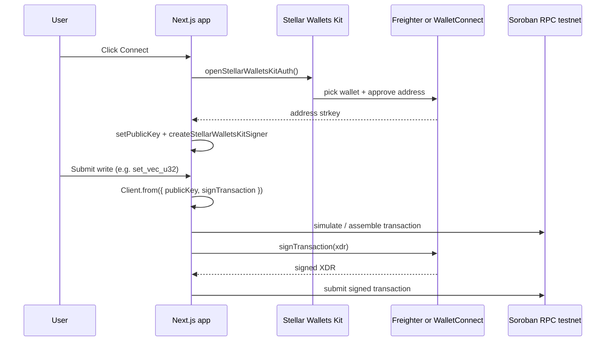

# Soroban fullstack POC — recent work (May 13–14, 2026)

This document summarizes **what changed over the last few days**, **why it was done**, **what is working today**, and **how** the pieces fit together: **contract data types**, **events**, **testing at every layer**, and **wallet setup** for testnet writes.

It is written for someone joining the repo or preparing a demo; it is **not** a substitute for reading `README.md`, `frontend/app/docs`, or the contract source.

---

## 1. Timeline (git history)

Recent commits on `main` (newest first), covering **May 13–14, 2026**:

| Commit | Date | Summary |
|--------|------|---------|
| `f780265` | 2026-05-14 | **Composite contract types + frontend “coverage” tier** — `Vec`, `Map`, plain `Address`, nested struct, enum; Makefile/deploy/README; `stellar.ts`; conditional home UI; bindings + interface JSON + `test-results.json`. |
| `092ad3e` | 2026-05-14 | **Event payload parity** — `BlobSet` / `CodeSet` / `PointerSet` event fields match **function arguments** (bytes, label string, optional address) for indexer-style testing. |
| `c585100` | 2026-05-14 | **Contract interface in repo** — formatted JSON, `make contract-interface-json` / `make contract-bindings`, `/bindings` UI. |
| `9c185ef` | 2026-05-13 | **Demo presets + Writes layout** — rotating fill presets, grid polish, WalletConnect log noise reduction. |
| `758cfd9` | 2026-05-13 | **Header + log + tests row** — polish and tests page contract id row. |
| `a67e366` | 2026-05-13 | **“Wide” and “full” primitive tiers** on contract + UI — `bool`, `i64`, `Bytes`, `u128`, `Symbol`, `Option<Address>`, `i128`; slot themes; overlay; Get-tile pulse; horizontal scroll for long values. |
| `0e59ab2` | 2026-05-13 | **Wallets Kit pastel + silent modal cancel** — UX when dismissing connect. |
| `1d76f07` | 2026-05-13 | **Stellar Wallets Kit integration** — hydration fix, connect error copy. |
| `a187cd2` | 2026-05-13 | **WalletConnect modal** — tabs anchored above “All Wallets”. |
| `2b2c424` | 2026-05-13 | **WalletConnect stability** — Reown / testnet wiring. |
| `83e143b` | 2026-05-13 | **Multi-wallet** — Freighter + WalletConnect via Wallets Kit; `signTransaction` from context; README / `.env.example` / Next transpile. |

**Narrative arc:** first **multi-wallet testnet signing**, then **richer on-chain storage + events + UI** for many Soroban types, then **indexer-friendly event parity** for blob/code/pointer, then **composite types** (`Vec`, `Map`, struct, enum, plain `Address`) with a **frontend tier** that only shows those controls when the **deployed wasm** actually exposes the new getters.

---

## 2. Why we did it (goals)

1. **Education / POC** — Show a **full stack**: Rust Soroban contract → wasm → testnet deploy → Next.js UI that **simulates reads** (no wallet) and **submits writes** (wallet).
2. **Indexer and analytics demos** — Emit **typed `contractevent`** structs so downstream tools can practice **decoding stable payloads**. For several events, the payload **matches the invocation** (same bytes, same string, same optional address, same `Vec`, same `Map`, etc.) so “what was sent” equals “what was logged.”
3. **Type coverage** — Exercise many **Soroban SDK types** in one small contract: scalars, `String`, `Symbol`, `Bytes`, `Option<Address>`, `Address`, `Vec`, `Map`, nested `#[contracttype]` struct, and `#[contracttype]` enum — bounded so storage and gas stay predictable.
4. **Progressive enhancement in the UI** — Older testnet deployments only expose `get`/`set`. The app **detects** which getters exist (from the **on-chain contract spec** used to build the TS client) and **enables** only the matching read/write tiles, with **copy** that tells you to redeploy when wasm lags the repo.

---

## 3. What is working end-to-end

| Layer | Working behavior |
|--------|------------------|
| **Contract** | `cargo test` passes (unit + integration + Proptest + invariants); wasm builds; **32 exported functions** on latest wasm. |
| **Deploy** | `make deploy` (Stellar CLI + funded testnet identity) uploads wasm and returns a **new contract id**; `scripts/deploy-testnet.sh` writes `frontend/contract-spec/poc-contract-deploy.meta.json`. |
| **Bindings** | `make contract-bindings` refreshes `basic-storage-interface.json` and `frontend/lib/basic-storage-bindings/` from wasm. |
| **Reads (no wallet)** | Home page calls `readContractSnapshot()` → RPC **simulation** of `get*` methods; shows stored values per slot. |
| **Writes (wallet)** | User connects via **Stellar Wallets Kit** → `signTransaction` signs assembled Soroban txs → Freighter or WalletConnect on **testnet**. |
| **`/tests`** | Loads `frontend/public/test-results.json` (from `node scripts/export-test-results.mjs` or `make sync-tests`) — per-test rows, categories, optional LLVM coverage JSON. |
| **`/bindings`** | Shows formatted interface JSON + spec capture time from meta file. |
| **`/docs`** | In-app documentation for env, Makefile, contract API table, tiering behavior. |

**Requires operator setup:** `NEXT_PUBLIC_CONTRACT_ID` in `frontend/.env.local` (and on Vercel) must point at wasm that **matches** the features you expect; otherwise the UI correctly **downgrades** to fewer slots.

---

## 4. Contract: every datatype, how it works

All state lives in **`persistent` storage** keyed by **`DataKey`** (a `#[contracttype]` enum). Each **setter** writes one key and **publishes** one **single-value** `contractevent` (where applicable) so indexers see a typed payload.

### 4.1 Primitive and “narrow” types

| Concept | Soroban / contract API | Storage key | Default read (if unset) | Event | Notes |
|--------|-------------------------|-------------|-------------------------|-------|--------|
| **u32** | `set` / `get` | `Value` | `0` | `ValueSet { value }` | Primary counter-style slot. |
| **i32** | `set_signed` / `get_signed` | `Signed` | `0` | `SignedSet { v }` | |
| **String** | `set_tag` / `get_tag` | `Tag` | empty string | `TagSet { label }` — **same `String` as input** | Max length enforced in UI; contract stores Soroban `String`. |
| **u64** | `set_counter` / `get_counter` | `Counter` | `0` | `CounterSet { n }` | |
| **bool** | `set_flag` / `get_flag` | `Flag` | `false` | `FlagSet { on }` | |
| **i64** | `set_i64` / `get_i64` | `WideI` | `0` | `I64Set { v }` | |
| **Bytes** | `set_blob` / `get_blob` | `Blob` | empty | **`BlobSet { data }` — same bytes as input** (max **64** bytes) | Bounds keep events + storage small. |
| **u128** | `set_u128` / `get_u128` | `WideU` | `0` | `WideU128Set { v }` | |
| **Symbol** | `set_symbol` / `get_symbol` | `Code` | `Symbol` `_` | **`CodeSet { label }` — same UTF-8 `String` as input** before interning to `Symbol` | Symbol rules: typical ASCII subset, length 1–32 in contract. |
| **Option\<Address\>** | `set_pointer` / `get_pointer` | `Pointer` | `None` | **`PointerSet { who }` — same `Option<Address>` as input** | Cleared with `None`; strkey in TS client. |
| **i128** | `set_i128` / `get_i128` | `WideI128` | `0` | `WideI128Set { v }` | |

**Why events mirror inputs for Blob / Code / Pointer:** EVM and many indexers train teams to compare **calldata** to **log data**. Soroban is different, but aligning **invoke args** and **event payload** makes **integration tests** and **dashboard demos** easier (“hash the XDR argument” vs “decode event” should tell the same story).

### 4.2 Composite “coverage” types (latest wasm)

| Concept | Types | API | Storage key | Default read | Event | Bounds / validation |
|--------|--------|-----|-------------|--------------|-------|---------------------|
| **Vec\<u32\>** | `soroban_sdk::Vec<u32>` | `set_vec_u32` / `get_vec_u32` | `U32List` | empty vec | **`VecU32Set { items }` — same vec** | Max **16** elements. |
| **Map\<String, u32\>** | `Map<String, u32>` | `set_scores` / `get_scores` | `Scores` | empty map | **`ScoresSet { scores }` — same map** | Max **8** entries; key length 1–**24**. |
| **Address (required)** | `Address` | `set_plain_addr` / `get_plain_addr` | `PlainAddr` | **burn address** `GAAA…WHF` | **`PlainAddrSet { who }` — same address** | Distinct from **optional** pointer slot. |
| **Nested struct** | `OuterBits { inner: InnerBits, stamp: u64 }` | `set_nested` / `get_nested` | `Nested` | `inner.x = 0`, `stamp = 0` | **`NestedSet { outer }` — same struct** | Light validation possible; nested `InnerBits` carries `u32`. |
| **Enum** | `DemoWidget` — `Off` \| `On` \| `Pair(u32,u32)` | `set_widget` / `get_widget` | `Widget` | `Off` | **`WidgetSet { w }` — same enum** | Demonstrates tagged union storage. |

**How `Map` iteration validates:** `set_scores` walks `scores.iter()` and rejects empty or overly long keys before storing, so hostile maps cannot blow gas or storage.

**Why a separate `PlainAddr`:** The **Option\<Address\>** pointer already covers **nullable** account/contract references. A **non-optional** `Address` slot shows how contracts store “always present” addresses (here defaulted to the Stellar **burn** account when never set — a POC choice).

### 4.3 How Soroban represents these on the wire

- **`Symbol`**: compact interned string-like type (not arbitrary UTF-8); the contract accepts **`String`** for `set_symbol`, validates, then stores `Symbol`.
- **`String`**: heap-style string type in Soroban; used for tags and map keys in this POC.
- **`Bytes`**: opaque byte vector; capped here for safety.
- **`Vec` / `Map`**: collection types with `.len()`, `.get`, `.set`, iteration patterns; serialized in contract **custom types** for XDR.
- **`#[contracttype]` struct / enum**: appear in the **contract spec**; TypeScript bindings generate **`OuterBits`**, **`DemoWidget`** tagged unions, etc.

---

## 5. Frontend: how the app “knows” which types exist

The deployed contract **is the source of truth**. `Client.from()` loads the **on-chain interface**. `lib/stellar.ts` uses **`isClientFn(client, "get_…")`** to branch:

| Tier | Detection | Read / write UI |
|------|-------------|-----------------|
| **Base** | always | `get` / `set` (u32) |
| **Extended** | `get_signed`, `get_tag`, `get_counter` | + i32, String tag, u64 |
| **Wide** | `get_flag` | + bool, i64, Bytes, u128 |
| **Full** | `get_symbol` | + Symbol, Option Address pointer, i128 |
| **Coverage** | `get_vec_u32` | + Vec, Map, plain Address, nested struct, enum tiles and forms |

**Why gate the coverage grid:** If the UI always showed `get_vec_u32` tiles while the chain still had **old wasm**, users saw **“—”** rows and a **type count** that did not match visible cards. The UI now **renders** those five tiles **only** when `hasCoverageTypesApi === true`, and the **hero** only lists `VecU32Set`…`WidgetSet` in that case. A **lime** notice explains redeploy + `make contract-bindings` + env id when **full** tier exists but **coverage** does not.

**Write path:** Each `write*` helper builds a `Client` with `publicKey` + `signTransaction`, assembles the tx, then `signAndSend()`. Validation (ranges, string lengths, comma-separated vec, `key=value` map) happens **before** submit to fail fast and avoid bad txs.

---

## 6. Wallet setup (incredible detail)

### 6.1 What product we use

The app uses **[@creit-tech/stellar-wallets-kit](https://github.com/Creit-Tech/Stellar-WalletsKit)** (“Stellar Wallets Kit”, **SWK**), not a single-vendor hardcode. SWK aggregates:

- **Browser extensions** (Freighter, xBull, Albedo, LOBSTR, etc.) when installed.
- **WalletConnect** (via **Reown AppKit** / `@reown/appkit` + `@walletconnect/universal-provider`) when a **project id** is configured.

### 6.2 Environment variables

| Variable | Where | Purpose |
|----------|--------|---------|
| `NEXT_PUBLIC_CONTRACT_ID` | `frontend/.env.local` (gitignored) | Soroban **contract id** (C… strkey) for read/write RPC + client. |
| `NEXT_PUBLIC_WALLETCONNECT_PROJECT_ID` | `.env.local` / Vercel | Enables **WalletConnect** in the kit modal; omit to stay **extensions-only**. |

`frontend/.env.example` documents both. **`NEXT_PUBLIC_`** prefix is required for **browser** access in Next.js.

### 6.3 Runtime flow (connect → sign)



- **`WalletProvider`** (`frontend/contexts/wallet-context.tsx`) holds `publicKey` and builds **`signTransaction`** with `createStellarWalletsKitSigner(publicKey)` once connected.
- **`connectWallet`** opens SWK; if the user **dismisses** the modal, **`isSwkAuthModalDismissed`** swallows the error so the console stays clean.
- **Session restore:** on load, `ensureStellarWalletsKit()` then `StellarWalletsKit.getAddress()` may repopulate `publicKey` if the kit still has a session.

### 6.4 What `signTransaction` is

`SorobanTransactionSigner` (see `frontend/lib/wallet-types.ts`) is the shape the **Stellar SDK contract client** expects: a function that takes an **unsigned Soroban transaction XDR** (or equivalent handle) and returns **signed** bytes/XDR. SWK abstracts Freighter’s `signTransaction` vs WalletConnect’s **sign request** so `lib/stellar.ts` stays **wallet-agnostic**.

### 6.5 Network

- **Passphrase:** Stellar **testnet** (`Networks.TESTNET` in code).
- **RPC:** `https://soroban-testnet.stellar.org` (public Soroban endpoint in `lib/stellar.ts`).
- **Explorer links:** Stellar Expert testnet contract page from `NEXT_PUBLIC_CONTRACT_ID`.

### 6.6 Common pitfalls (why something “does not work”)

| Symptom | Likely cause |
|---------|----------------|
| Writes disabled | Wallet not connected, or **wrong tier** (old wasm missing `set_*`). |
| `txBadSeq` | Two writes overlapping; UI uses a **single-flight** overlay — submit one at a time. |
| Reads work, writes fail with missing method | **Contract id** points at **old** wasm; redeploy and update env. |
| WalletConnect missing | `NEXT_PUBLIC_WALLETCONNECT_PROJECT_ID` unset or wrong. |
| Hydration warnings | SWK is **client-only**; provider and modals are gated on `window` where needed. |

---

## 7. Testing: every layer, how it works, why it exists

### 7.1 Unit tests (`contracts/basic-storage/src/test.rs`)

- **One `Env::default()` per test**, register contract, get `BasicStorageContractClient`.
- **Direct calls** to setters/getters; `assert_eq!` / `assert!` on return values.
- **Coverage:** each new slot (vec, map, plain addr, nested, widget) has a **round-trip** test; existing tests cover u32 edges, i128 min/max, pointer Some/None, etc.
- **Why:** Fast feedback, no network, deterministic.

### 7.2 Integration tests (`contracts/basic-storage/tests/integration_contract.rs`)

- **Separate test binary** (`cargo test --test integration_contract`).
- **Multi-step scripts** in one `Env`: write many slots, read them back, then change **u32** and assert **i128** (and others) **unchanged** — proves **key isolation**.
- **Why:** Mirrors “real” client usage pattern closer than tiny unit slices; catches ordering / clone / event issues across slots.

### 7.3 Deterministic property sweep

- Test **`property_set_get_roundtrip_for_many_values`**: loop `0..100`, each time `set`/`get` must match.
- **Why:** Cheap “many cases” without Proptest RNG drift.

### 7.4 Proptest (`proptest!`)

- **`fuzz_set_get_random_u32`**: 256 random `u32` values.
- **Invariant tests**: random **sequences** of operations on **one slot** or **cross-slot** (e.g. only `set_u128` must not move primary `u32`).
- **Why:** Finds edge cases in last-write-wins and cross-key isolation; on failure Proptest **shrinks** to minimal counterexample.

### 7.5 Soroban test snapshots (`contracts/basic-storage/test_snapshots/`)

- Large tree of **JSON fixtures** recording ledger/host snapshots for tests that use the Soroban test harness macros.
- **Why:** When VM or SDK behavior shifts, diffs show **exact** state changes; CI can catch accidental semantic drift.

### 7.6 libFuzzer (`contracts/basic-storage/fuzz/`)

- **Not** part of default `cargo test`.
- **`make fuzz`** / `cargo fuzz run storage_set_get` decodes random bytes into operations on the contract harness.
- **Why:** Memory-unsafe bugs are unlikely in Soroban guest code, but fuzz still stress-decodes **argument decoding** paths.

### 7.7 LLVM coverage (`make coverage` / `cargo llvm-cov`)

- Optional; produces **`coverage-summary.json`** consumed by **`/tests`** when present.
- **Why:** Shows which lines in the contract and tests are exercised beyond pass/fail counts.

### 7.8 Exported dashboard JSON (`frontend/public/test-results.json`)

- **Producer:** `scripts/export-test-results.mjs`.
- **Default:** runs `cargo test` in `contracts/basic-storage`, parses **`test … ok`** lines and **`test result:`** tails, merges **`TEST_DETAILS`** human blurbs per test name.
- **`make sync-tests`:** runs **`make test-all-contract`** (full suite + optional fuzz smoke), **tees** log to disk, then runs the exporter with **`CONTRACT_TEST_LOG_PATH`** so tests are **not run twice**.
- **Embeds `pocContractId`** from `frontend/.env.local` at export time for context on the tests page (not used by Rust).
- **Why:** The website can show **real** pass counts and per-test explanations **without** running Rust in the browser.

---

## 8. Makefile and deploy ergonomics

- **`make build-contract`:** prefers **Stellar CLI** `stellar contract build` with **`unset CARGO_TARGET_DIR`** so wasm lands under **`contracts/basic-storage/target/wasm32v1-none/release/`** — same path **`make contract-bindings`** reads. Avoids stale wasm when a global `CARGO_TARGET_DIR` redirected build output elsewhere.
- **`scripts/deploy-testnet.sh`:** uses **`stellar contract build --out-dir`** to the same release directory, then **`stellar contract deploy`** with your **`SOURCE_ACCOUNT`** identity on testnet.
- **`make contract-bindings`:** interface JSON + TS bindings; requires Stellar CLI.

---

## 9. Files to read next

| Topic | Path |
|--------|------|
| Contract | `contracts/basic-storage/src/lib.rs`, `src/test.rs`, `tests/integration_contract.rs` |
| Wallet | `frontend/contexts/wallet-context.tsx`, `frontend/lib/stellar-wallets-kit-client.ts` |
| RPC + snapshot reads / writes | `frontend/lib/stellar.ts` |
| Home UI | `frontend/app/page.tsx` |
| Tests dashboard | `frontend/app/tests/page.tsx`, `scripts/export-test-results.mjs` |
| In-app docs | `frontend/app/docs/page.tsx` |
| Repo overview | `README.md`, `docs/POC_DELIVERABLES.md` |

---

## 10. Changelog maintenance

When you add Rust tests, also add a **`TEST_DETAILS[name]`** entry in `scripts/export-test-results.mjs` so **`/tests`** rows show a helpful sentence instead of **—**. After changing tests, run:

```bash
node scripts/export-test-results.mjs
```

or **`make sync-tests`** for the full pipeline.

This document reflects the **author’s understanding** of the repo as of **May 14, 2026**; if git history or files drift, prefer **source** and **`git log`** as final truth.
