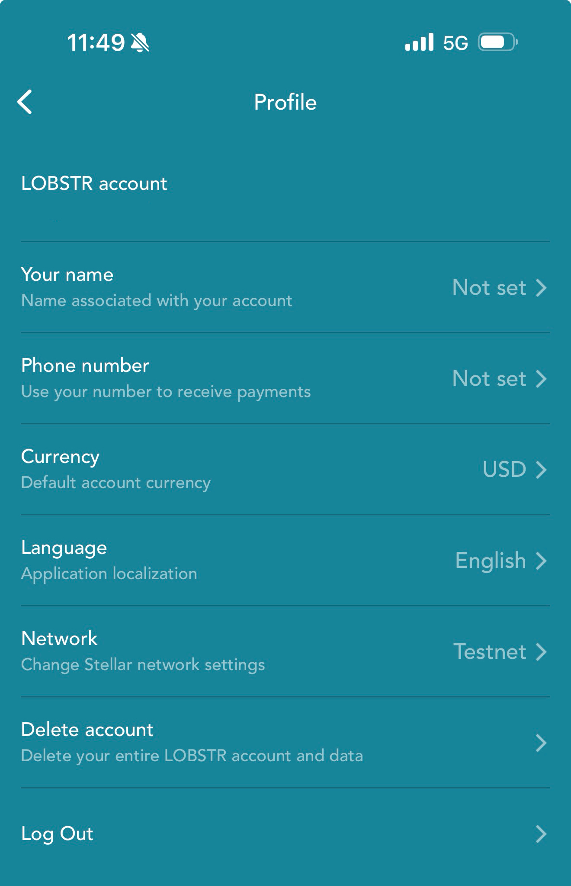
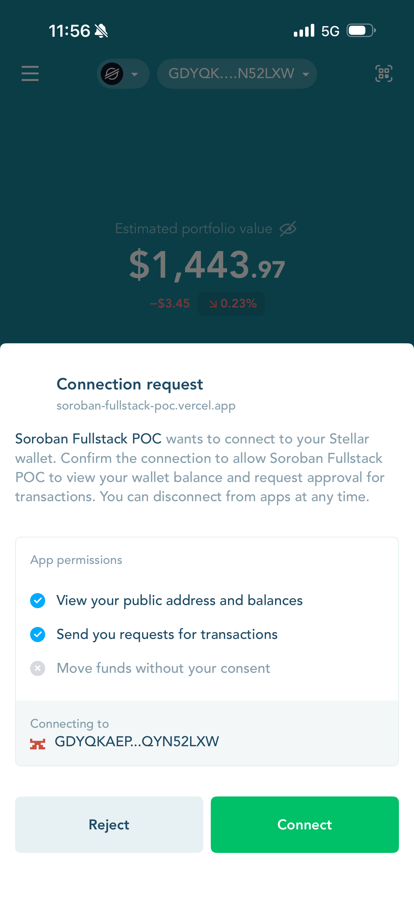
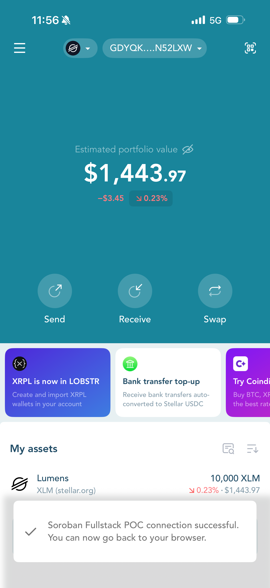
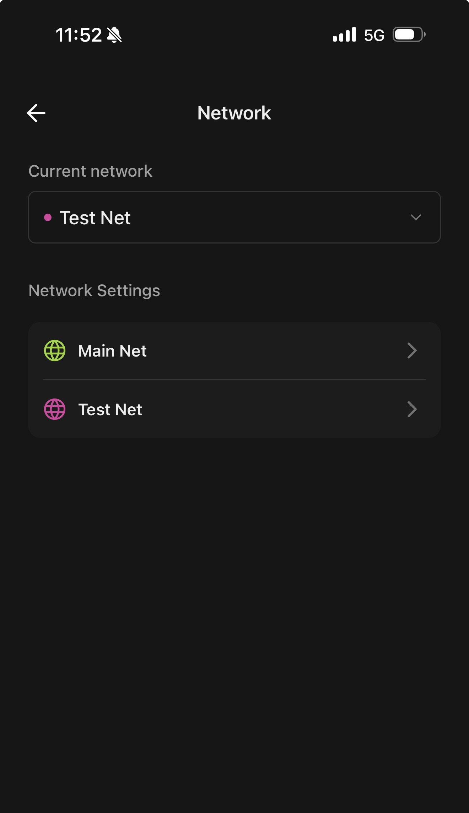
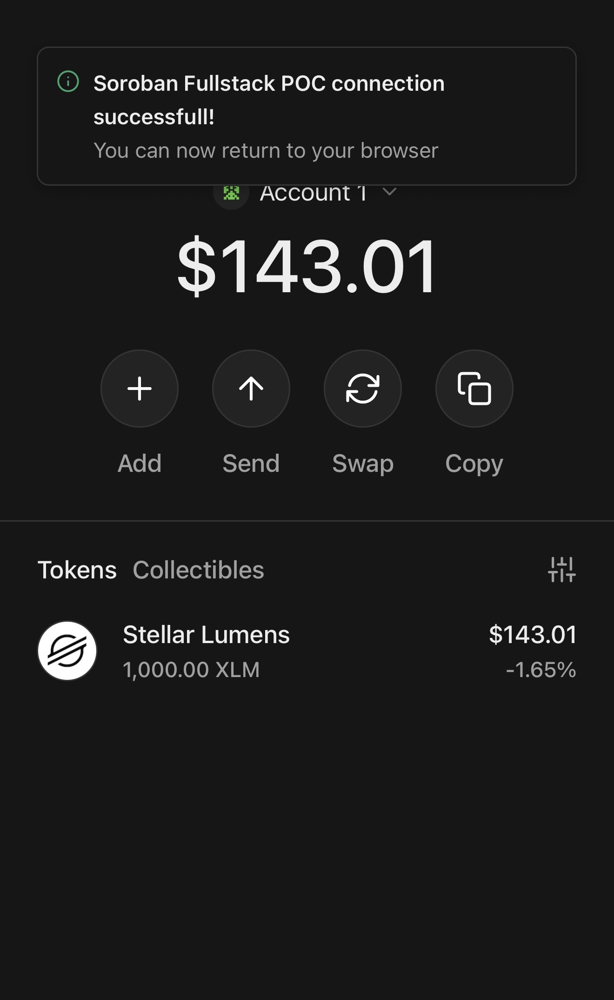
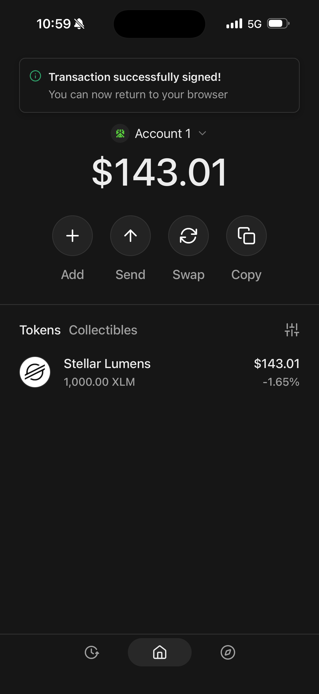

# WalletConnect mobile — Freighter & LOBSTR success log

This document records **verified WalletConnect flows** from the **Soroban Fullstack POC** (desktop browser / Vercel) to **mobile Stellar wallets**:

| Path | What we verified |
|------|------------------|
| **WalletConnect → LOBSTR** | QR / WC pairing; connection request + success for `soroban-fullstack-poc.vercel.app` |
| **WalletConnect → Freighter** | QR scan, connect, `set()` confirm/sign, and Stellar Expert tx proof on testnet |

Not MetaMask or other EVM wallets.

**Live app:** [soroban-fullstack-poc.vercel.app](https://soroban-fullstack-poc.vercel.app)  
**Network:** `stellar:testnet` via Stellar Wallets Kit + Reown WalletConnect.

---

## LOBSTR — WalletConnect connect (mobile QR)

| Field | Value |
|--------|--------|
| **Path** | **WalletConnect** (desktop POC) → **LOBSTR** (mobile) |
| **Wallet app** | LOBSTR (mobile) |
| **dApp** | Soroban Fullstack POC / `soroban-fullstack-poc.vercel.app` |
| **Account shown in UI** | `GDYQK…N52LXW` (approve on connection request screen) |
| **Result** | “Soroban Fullstack POC connection successful” — return to browser |

Use **Settings → Profile → Network → Testnet** in LOBSTR before WalletConnect or writes (this POC is **testnet** only). Then **Settings → WalletConnect** to scan the desktop QR (not the phone Camera app).

**Writes failing with `Account not found`?** LOBSTR can show “connection successful” while your `G…` exists on **mainnet** but not testnet. Fix: **Network → Testnet**, then fund the same address on testnet: [Friendbot](https://friendbot.stellar.org/?addr=GDYQKAEPG3RUUQOEDRARAXSGP6BQASATLOZHQTDARQ2YX4J6QYN52LXW) (one-time per `G…` on testnet).

### Screenshots (WalletConnect → LOBSTR)

#### 1. Enable Testnet (Profile → Network)



Web: `/howtolobstrchangenetworktostellartestnetgotosettingsprofilenetworkstellartestnet.JPG`

#### 2. Connection request



Web: `/Lobstrconnectionrequestwith walletconnectlobstrSorobanfullstackpoc.PNG`

#### 3. Connection successful



Web: `/Lobstrwalletconnectionsorobanfullstack walletconnectsuccessful .PNG`

---

## Freighter — WalletConnect connect, sign, and explorer

| Field | Value |
|--------|--------|
| **Public key** | `GBOE2WOJGWZATO2PXEBF7R74T5QOE7XFGNL55I4AIWEESWNC347YYNRI` |
| **Path** | **WalletConnect** (desktop dApp) → **Freighter** (mobile) |
| **Wallet app** | Freighter (mobile) — paired via WalletConnect |
| **Connection** | WalletConnect QR / URI from POC → Freighter in-app scanner |
| **dApp** | Soroban Fullstack POC / `soroban-fullstack-poc.vercel.app` |
| **Contract (explorer filter)** | `CBGX…6O2R` — full **C…** id on [Stellar Expert contract page](https://stellar.expert/explorer/testnet/contract) when you click the contract chip in the UI |

**Account (testnet):**  
https://stellar.expert/explorer/testnet/account/GBOE2WOJGWZATO2PXEBF7R74T5QOE7XFGNL55I4AIWEESWNC347YYNRI

Use **Settings → Network → Test Net** in Freighter before WalletConnect or writes (this POC is **testnet** only).

---

## How to get the transaction link (Stellar Expert)

On the screen with **Filters → `CBGX…6O2R`** and the table **Transaction | Date**:

1. **Click the transaction row** itself — the line that says  
   `GBOE…YNRI invoked contract CBGX…6O2R set(42 u32)`  
   (or the **date** on the right, e.g. `2026-05-20 15:00:38 UTC`).
2. Stellar Expert opens the **transaction detail** page.
3. **Copy the URL** from the browser address bar. It will look like:

   ```text
   https://stellar.expert/explorer/testnet/tx/<64-character-hex-hash>
   ```

4. That URL is your **transaction link** for docs, PRs, or Teams.

**Other ways to get the same link:**

| Where | Action |
|--------|--------|
| **Account page** | Open your `G…` account → **Transactions** → click the row → copy URL |
| **Contract page** | Open the **C…** contract → activity list → click the invoke row → copy URL |
| **Home app log** | After a write, copy hash from the POC **Transaction log** if shown, then open `https://stellar.expert/explorer/testnet/tx/<hash>` |
| **Horizon (API)** | `https://horizon-testnet.stellar.org/transactions/<hash>` (same hash, different UI) |

The **filter chip** (`CBGX…6O2R`) only narrows the list; it is **not** the transaction link. You need one click into a **specific transaction**.

---

## Transaction log (verified writes)

| # | Date (UTC) | Method | Tx hash | Transaction link | Result |
|---|------------|--------|---------|------------------|--------|
| 1 | 2026-05-20 15:00:03 | `set(0 u32)` | `2833e7300a51d2ec713b0e411fa6f2854537b8161d0afaab53fe007e109eac2f` | [Stellar Expert](https://stellar.expert/explorer/testnet/tx/2833e7300a51d2ec713b0e411fa6f2854537b8161d0afaab53fe007e109eac2f) · [Horizon](https://horizon-testnet.stellar.org/transactions/2833e7300a51d2ec713b0e411fa6f2854537b8161d0afaab53fe007e109eac2f) | Success — `Value` → 0, `ValueSet` event |
| 2 | 2026-05-20 15:00:38 | `set(42 u32)` | `a9a96caf69334fb937b4ce144d03a0996749d896a4acdd7b95b32eaf8c82f29b` | [Stellar Expert](https://stellar.expert/explorer/testnet/tx/a9a96caf69334fb937b4ce144d03a0996749d896a4acdd7b95b32eaf8c82f29b) · [Horizon](https://horizon-testnet.stellar.org/transactions/a9a96caf69334fb937b4ce144d03a0996749d896a4acdd7b95b32eaf8c82f29b) | Success — `Value` → 42, `ValueSet` event |

### On-chain detail (`set(42 u32)` — tx #2)

From Stellar Expert transaction view (matches your paste):

```text
Invoked contract CBGX…6O2R set(42 u32)
Contract CBGX…6O2R raised event ["value_set" sym] with data 42 u32
Contract CBGX…6O2R updated persistent data ["Value" sym] = 42 u32
```

Fee summary (from explorer): refundable 411, non-refundable 6,715 stroops; 1 emitted event (84B).

---

## Screenshots (WalletConnect → Freighter)

Every image in this section is **WalletConnect on the POC** connecting to or signing in **Freighter mobile**.

### 1. Enable Test Net (Settings → Network)



Web: `/howtofreighterwalletchangenetworktostellartestnetgotosettingsprofilenetworkstellartestnet.jpg`

### WalletConnect pairing (Freighter)

#### 2. Scan QR (Freighter mobile)


Web: `/scanningwalletconnectonphone.jpg`

#### 3. Connection success



Web: `/successfulSorobanfullstackpocconnectiononphone.jpg`

### Mobile sign flow in Freighter (`set()` via WalletConnect)

#### 4. Confirm transaction (Test Net, fee ~0.006 XLM)

withmobilewallet.PNG)

Web: `/mobilescreenshotyoucanseetransactionset()withmobilewallet.PNG`

#### 5. Transaction successfully signed



Web: `/transactionsuccessfullysignmobiledwallet.PNG`

### Desktop block explorer (contract interactions)

ontheblockexploreryoucanseethistranasctioncontractinteraction.png)

Web: `/blockexploererondesktopyoucanseethatthemobilewallettransactionyaddressucessfullyinvolkedset()ontheblockexploreryoucanseethistranasctioncontractinteraction.png`

---

## Checklist

| Step | LOBSTR | Freighter |
|------|--------|-----------|
| LOBSTR Network → Testnet (Profile) | ✅ | — |
| Freighter Network → Test Net (Settings) | — | ✅ |
| WalletConnect pairing from in-app scanner | ✅ | ✅ |
| dApp shows connected on phone | ✅ | ✅ |
| Mobile confirm `set()` on testnet | — | ✅ |
| Mobile “Transaction successfully signed!” | — | ✅ |
| Explorer shows writes on contract | — | ✅ (`set(0)`, `set(42)`) |
| Transaction links in table above | — | ✅ |

---

## App transaction log (optional paste)

```text
<!-- Paste lines from the POC home Transaction log after future writes -->

```

---

## Related docs

- In-app: [`/tests/mobilewallet`](https://soroban-fullstack-poc.vercel.app/tests/mobilewallet) → **WalletConnect mobile (verified)** (screenshots + tx links)  
- `docs/Meeting-Talking-Points-May-19-2026.md`  
- `docs/RecentWork-SorobanPOC-May2026.md`  
- `README.md`

---

*Last updated: 2026-05-20 — LOBSTR WalletConnect connect + Freighter connect/sign/explorer verified on testnet.*
