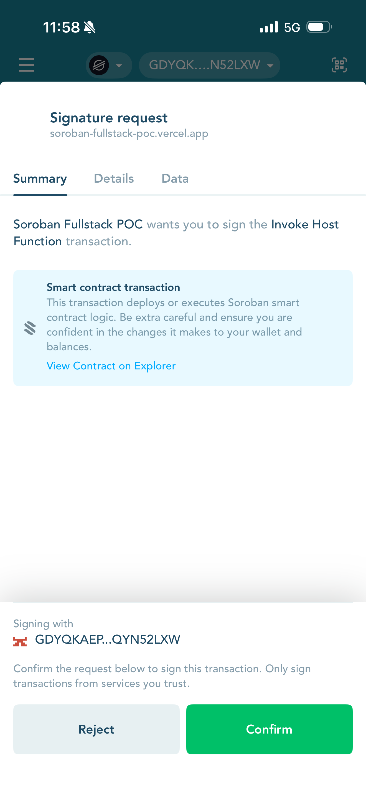
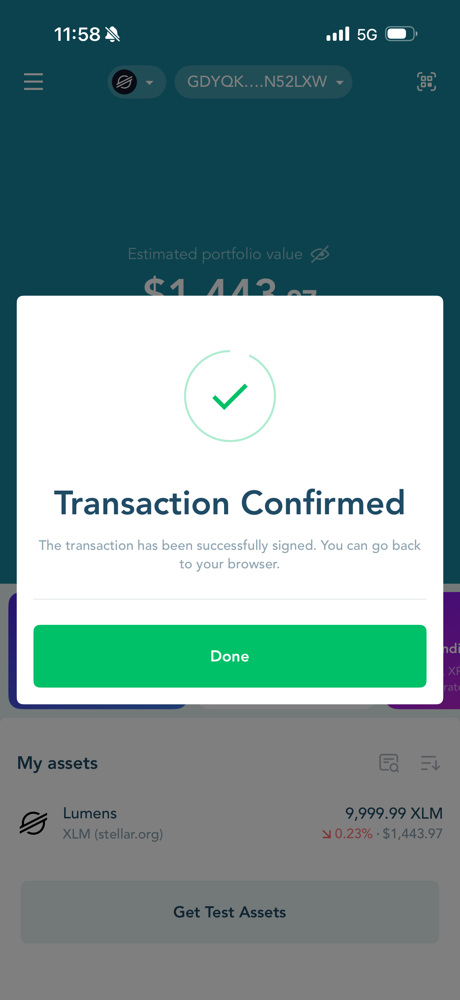
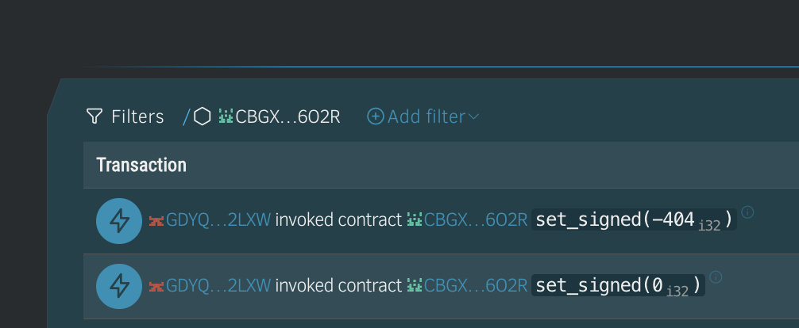
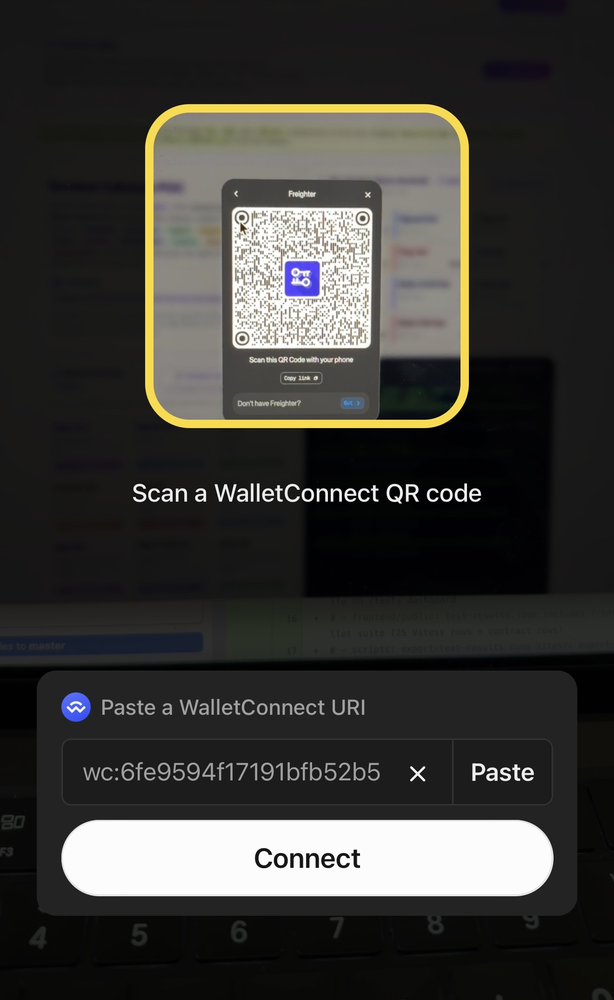

# WalletConnect mobile — Freighter & LOBSTR success log

This document records **verified WalletConnect flows** from the **Soroban Fullstack POC** (desktop browser or [Vercel](https://soroban-fullstack-poc.vercel.app)) to **mobile Stellar wallets**. It is the **evidence pack** for stakeholder demos, Stellar engagement reviews, and regression QA when wallet kit or Reown config changes.

**Not in scope:** MetaMask, Ethereum WalletConnect, or custodial APIs without a Stellar signer.

---

## Executive summary

| Path | What we verified | On-chain proof |
|------|------------------|----------------|
| **WalletConnect → LOBSTR** | QR pairing, connection approval, **Invoke Host Function** sign, tx confirmed | `set_signed` txs on testnet (table below) |
| **WalletConnect → Freighter** | QR scan, connect, **`set()`** confirm/sign, success toast | `set(0)`, `set(42)` txs on testnet (table below) |

**Live app:** [soroban-fullstack-poc.vercel.app](https://soroban-fullstack-poc.vercel.app)  
**Network:** `stellar:testnet` only — via **Stellar Wallets Kit** and **Reown WalletConnect** when `NEXT_PUBLIC_WALLETCONNECT_PROJECT_ID` is set.

---

## Architecture (how the POC wires wallets)

```text
Browser (Next.js home page)
    → WalletProvider / Stellar Wallets Kit (@creit-tech/stellar-wallets-kit)
        → Extension wallets (Freighter desktop, etc.)  OR
        → WalletConnect (Reown) QR / deep link
            → Mobile Freighter or LOBSTR (in-app WC scanner)
    → @stellar/stellar-sdk (Soroban RPC simulate + submit)
        → basic-storage contract on testnet (NEXT_PUBLIC_CONTRACT_ID)
```

**Code touchpoints**

| Area | Path |
|------|------|
| Wallet kit + connect UI | `frontend/contexts/wallet-context.tsx` (and related layout) |
| Soroban read/write | `frontend/lib/stellar.ts` |
| Mobile QA section on `/tests` | `frontend/components/WalletConnectMobileVerification.tsx` |
| In-app docs | `frontend/app/docs/page.tsx` → WalletConnect section |
| Env template | `frontend/.env.example` |

**Configuration**

| Variable | Required | Purpose |
|----------|----------|---------|
| `NEXT_PUBLIC_CONTRACT_ID` | Yes (for writes) | Soroban contract `C…` on testnet |
| `NEXT_PUBLIC_WALLETCONNECT_PROJECT_ID` | For WC | Reown Cloud project id; add **allowed origins** (`http://localhost:3000`, Vercel URL) |

Without WalletConnect project id, **extension-only** connect may still work; **mobile QR** flows need the id.

---

## Preconditions (both wallets)

1. **Testnet only** — mainnet accounts will not fund Soroban invokes on testnet.
2. **Fund the mobile `G…` on testnet** — [Friendbot](https://friendbot.stellar.org/) once per address.
3. **Scan inside the wallet app** — use **Settings → WalletConnect** (LOBSTR) or Freighter’s **WC scanner**, not the phone Camera app alone.
4. **Desktop dApp open** — home page connected state should show the same network (`stellar:testnet`).

---

## LOBSTR — WalletConnect connect and writes

### Session metadata

| Field | Value |
|--------|--------|
| **Path** | WalletConnect (desktop POC) → LOBSTR (mobile) |
| **Wallet app** | LOBSTR (mobile) |
| **dApp** | Soroban Fullstack POC / `soroban-fullstack-poc.vercel.app` |
| **Account (testnet)** | `GDYQKAEPG3RUUQOEDRARAXSGP6BQASATLOZHQTDARQ2YX4J6QYN52LXW` |
| **Connection UI** | “Soroban Fullstack POC connection successful” — return to browser |

### Operator steps (LOBSTR)

1. **Settings → Profile → Network → Testnet** (screenshot 1 below).
2. On desktop POC: **Connect** → choose WalletConnect → show QR.
3. LOBSTR: **Settings → WalletConnect** → scan QR → approve connection.
4. On desktop: use **Writes** (e.g. signed slot) → confirm **Invoke Host Function** on phone → wait for confirmed toast.

### Troubleshooting (LOBSTR)

| Symptom | Likely cause | Fix |
|---------|--------------|-----|
| Connection OK but write fails `Account not found` | Account exists on **mainnet** only | Switch LOBSTR to **Testnet**, fund via Friendbot |
| QR does nothing | Scanned with Camera, not LOBSTR WC | Use in-app WalletConnect scanner |
| Wrong contract / read fails | Stale `NEXT_PUBLIC_CONTRACT_ID` on Vercel | Redeploy env; match `poc-contract-deploy.meta.json` |
| No WC option on desktop | Missing `NEXT_PUBLIC_WALLETCONNECT_PROJECT_ID` | Set Reown id + allowed origin |

### Screenshots (WalletConnect → LOBSTR)

#### 1. Enable Testnet (Profile → Network)


Web: `/howtolobstrchangenetworktostellartestnetgotosettingsprofilenetworkstellartestnet.JPG`

#### 2. Connection request


#### 3. Connection successful


Toast: “Soroban Fullstack POC connection successful. You can now go back to your browser.”

#### 4. Signature request — Invoke Host Function



#### 5. Transaction confirmed



#### 6. Stellar Expert — `set_signed` on contract



Shows `GDYQKAEP…YN52LXW` → contract `CBGX…6O2R` with `set_signed(0 i32)` and `set_signed(-404 i32)` (filter by contract; click row for tx link).

### Transaction log (verified writes — LOBSTR)

| # | Date (UTC) | Method | Tx hash | Transaction link | Result |
|---|------------|--------|---------|------------------|--------|
| 1 | 2026-05-20 15:58:43 | `set_signed(-404 i32)` | `282f4724b72843307a71ad2207030c5720e71843fe50d7497636c643ab1bd372` | [Stellar Expert](https://stellar.expert/explorer/testnet/tx/282f4724b72843307a71ad2207030c5720e71843fe50d7497636c643ab1bd372) · [Horizon](https://horizon-testnet.stellar.org/transactions/282f4724b72843307a71ad2207030c5720e71843fe50d7497636c643ab1bd372) | Success — signed slot updated |
| 2 | 2026-05-20 15:58:23 | `set_signed(0 i32)` | `4aaa81a56c1ffd028ef6a26cb613991f6dc59632d16555bb23af129339a75d01` | [Stellar Expert](https://stellar.expert/explorer/testnet/tx/4aaa81a56c1ffd028ef6a26cb613991f6dc59632d16555bb23af129339a75d01) · [Horizon](https://horizon-testnet.stellar.org/transactions/4aaa81a56c1ffd028ef6a26cb613991f6dc59632d16555bb23af129339a75d01) | Success — signed slot updated |

**Account (testnet):**  
https://stellar.expert/explorer/testnet/account/GDYQKAEPG3RUUQOEDRARAXSGP6BQASATLOZHQTDARQ2YX4J6QYN52LXW

---

## Freighter — WalletConnect connect, sign, and explorer

### Session metadata

| Field | Value |
|--------|--------|
| **Public key (testnet)** | `GBOE2WOJGWZATO2PXEBF7R74T5QOE7XFGNL55I4AIWEESWNC347YYNRI` |
| **Path** | WalletConnect (desktop dApp) → Freighter (mobile) |
| **Connection** | WC QR from POC → Freighter in-app scanner |
| **dApp** | Soroban Fullstack POC / `soroban-fullstack-poc.vercel.app` |
| **Contract (explorer)** | `CBGX…6O2R` — full `C…` from UI / env |

**Account (testnet):**  
https://stellar.expert/explorer/testnet/account/GBOE2WOJGWZATO2PXEBF7R74T5QOE7XFGNL55I4AIWEESWNC347YYNRI

Use **Settings → Network → Test Net** before WalletConnect or writes.

### Operator steps (Freighter)

1. Freighter mobile: **Settings → Network → Test Net** (screenshot 1).
2. Desktop: **Connect** → WalletConnect → QR.
3. Freighter: scan QR → approve session.
4. Desktop: **set** primary value (e.g. 42) → confirm on phone → verify explorer row + home log.

### Troubleshooting (Freighter)

| Symptom | Likely cause | Fix |
|---------|--------------|-----|
| “Transaction successfully signed” but no ledger change | Wrong network on phone | Test Net + testnet-funded `G…` |
| Simulation error on desktop | Bad args or missing contract id | Check env `C…`; try **Fill demo values** |
| WC session drops | Background app killed | Re-scan QR |

---

## How to get the transaction link (Stellar Expert)

On the screen with **Filters → `CBGX…6O2R`** and the table **Transaction | Date**:

1. **Click the transaction row** — e.g.  
   `GBOE…YNRI invoked contract CBGX…6O2R set(42 u32)`  
   (or the **date** column).
2. Stellar Expert opens **transaction detail**.
3. **Copy the URL** from the address bar:

   ```text
   https://stellar.expert/explorer/testnet/tx/<64-character-hex-hash>
   ```

4. Use that URL in docs, PRs, or Teams.

**Other ways to get the same link**

| Where | Action |
|--------|--------|
| **Account page** | Open `G…` → **Transactions** → click row → copy URL |
| **Contract page** | Open `C…` → activity → click invoke row → copy URL |
| **Home app log** | After write, copy hash from **Transaction log** → open Expert `/tx/<hash>` |
| **Horizon (API)** | `https://horizon-testnet.stellar.org/transactions/<hash>` |

The **filter chip** (`CBGX…6O2R`) only narrows the list; it is **not** the transaction link.

---

## Transaction log (verified writes — Freighter)

| # | Date (UTC) | Method | Tx hash | Transaction link | Result |
|---|------------|--------|---------|------------------|--------|
| 1 | 2026-05-20 15:00:03 | `set(0 u32)` | `2833e7300a51d2ec713b0e411fa6f2854537b8161d0afaab53fe007e109eac2f` | [Stellar Expert](https://stellar.expert/explorer/testnet/tx/2833e7300a51d2ec713b0e411fa6f2854537b8161d0afaab53fe007e109eac2f) · [Horizon](https://horizon-testnet.stellar.org/transactions/2833e7300a51d2ec713b0e411fa6f2854537b8161d0afaab53fe007e109eac2f) | Success — `Value` → 0, `ValueSet` event |
| 2 | 2026-05-20 15:00:38 | `set(42 u32)` | `a9a96caf69334fb937b4ce144d03a0996749d896a4acdd7b95b32eaf8c82f29b` | [Stellar Expert](https://stellar.expert/explorer/testnet/tx/a9a96caf69334fb937b4ce144d03a0996749d896a4acdd7b95b32eaf8c82f29b) · [Horizon](https://horizon-testnet.stellar.org/transactions/a9a96caf69334fb937b4ce144d03a0996749d896a4acdd7b95b32eaf8c82f29b) | Success — `Value` → 42, `ValueSet` event |

### On-chain detail (`set(42 u32)` — tx #2)

```text
Invoked contract CBGX…6O2R set(42 u32)
Contract CBGX…6O2R raised event ["value_set" sym] with data 42 u32
Contract CBGX…6O2R updated persistent data ["Value" sym] = 42 u32
```

Fee summary (explorer): refundable 411, non-refundable 6,715 stroops; 1 emitted event (84B).

---

## Screenshots (WalletConnect → Freighter)

Every image below is **WalletConnect on the POC** connecting to or signing in **Freighter mobile**.

### 1. Enable Test Net (Settings → Network)


Web: `/howtofreighterwalletchangenetworktostellartestnetgotosettingsprofilenetworkstellartestnet.jpg`

### WalletConnect pairing

#### 2. Scan QR (Freighter mobile)



Web: `/freighterscanQRcode.jpg`

#### 3. Connection success


Web: `/successfulSorobanfullstackpocconnectiononphone.jpg`

### Mobile sign flow (`set()` via WalletConnect)

#### 4. Confirm transaction (Test Net, fee ~0.006 XLM)

withmobilewallet.PNG)

Web: `/mobilescreenshotyoucanseetransactionset()withmobilewallet.PNG`

#### 5. Transaction successfully signed


Web: `/transactionsuccessfullysignmobiledwallet.PNG`

### Desktop block explorer

ontheblockexploreryoucanseethistranasctioncontractinteraction.png)

Web: `/blockexploererondesktopyoucanseethatthemobilewallettransactionyaddressucessfullyinvolkedset()ontheblockexploreryoucanseethistranasctioncontractinteraction.png`

---

## Regression checklist (re-run before claiming “still works”)

| Step | LOBSTR | Freighter |
|------|--------|-----------|
| Wallet network → testnet | ☐ | ☐ |
| Testnet account funded (Friendbot) | ☐ | ☐ |
| Vercel/local env: contract id + WC project id | ☐ | ☐ |
| WC pairing from **in-app** scanner | ☐ | ☐ |
| dApp shows connected | ☐ | ☐ |
| Mobile sign Invoke Host Function | ☐ | ☐ |
| Mobile tx confirmed toast | ☐ | ☐ |
| Stellar Expert tx link captured | ☐ | ☐ |
| Event + storage visible on tx detail | ☐ | ☐ |

Copy ✅ from the table in the previous section when you are **not** re-running QA.

---

## Verified checklist (2026-05-20 snapshot)

| Step | LOBSTR | Freighter |
|------|--------|-----------|
| LOBSTR Network → Testnet (Profile) | ✅ | — |
| Freighter Network → Test Net (Settings) | — | ✅ |
| WalletConnect pairing from in-app scanner | ✅ | ✅ |
| dApp shows connected on phone | ✅ | ✅ |
| LOBSTR sign Invoke Host Function (mobile) | ✅ | — |
| LOBSTR transaction confirmed (mobile) | ✅ | — |
| Explorer shows LOBSTR `set_signed` on contract | ✅ | — |
| Mobile confirm `set()` on testnet | — | ✅ |
| Mobile “Transaction successfully signed!” | — | ✅ |
| Explorer shows writes on contract | — | ✅ (`set(0)`, `set(42)`) |
| Transaction links in table above | ✅ | ✅ |

---

## Meeting talking points (30 seconds)

> We proved **mobile WalletConnect** from our Soroban POC to **LOBSTR and Freighter** on **testnet**: connect, sign **Invoke Host Function**, and **on-chain verification** on Stellar Expert with real transaction hashes. Desktop uses **Stellar Wallets Kit** and **Reown**; the contract emits **`ValueSet` / `SignedSet`** events for indexer work. This is the wallet path tokenization demos can build on — not EVM WC.

---

## App transaction log (optional paste)

Paste fresh lines from the POC home **Transaction log** after new writes:

```text
<!-- Example:
2026-05-21 … set(99 u32) hash=…
-->
```

---

## Related docs

- In-app: [`/tests/mobilewallet`](https://soroban-fullstack-poc.vercel.app/tests/mobilewallet) — embedded screenshots + links  
- [POC workstream map](./POC_WORKSTREAM_TRACKING.md) — FE / wallet row marked **Done**  
- [Contract tests dashboard](../frontend/docs/ContractTestsDashboard.md) — Rust test evidence  
- `docs/RecentWork-SorobanPOC-May2026.md` (if present on your branch)  
- [README.md](../README.md) — deploy, env, Makefile

---

*Last updated: 2026-05-20 — LOBSTR WalletConnect connect + signed writes; Freighter WalletConnect connect + `set()` writes; explorer-verified on testnet. Re-run regression checklist when upgrading stellar-wallets-kit or Reown project settings.*
